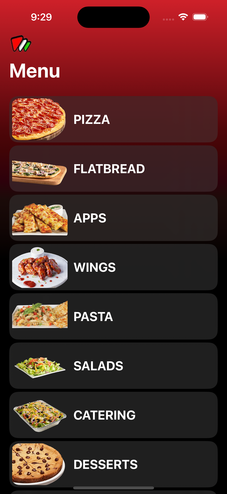
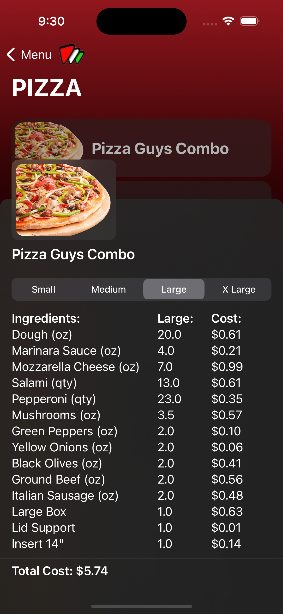
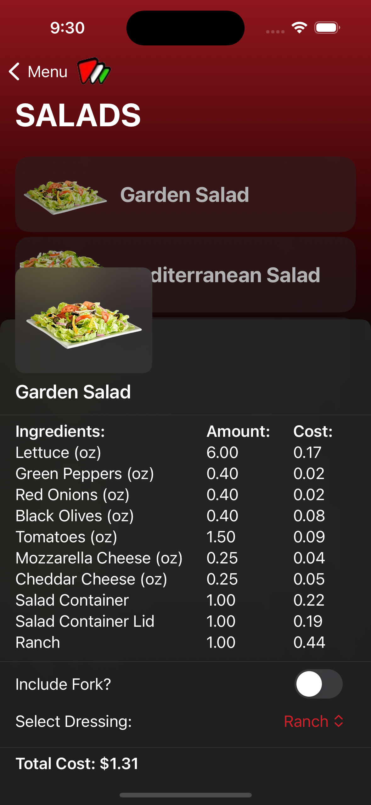
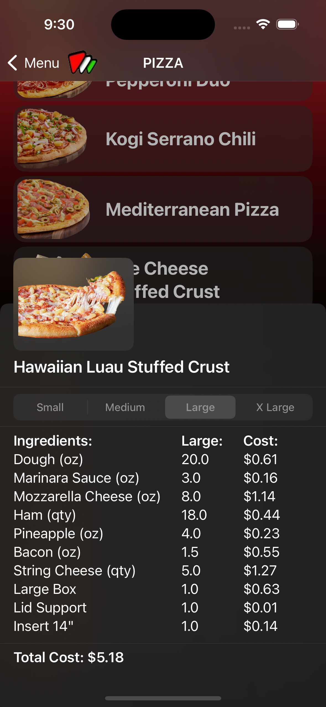

# Pizza Guys Food Item Cost Calculator 

## Overview
An iOS application developed to streamline Pizza Guys menu costing and inventory management. Built with SwiftUI and following MVVM architecture, this app provides real-time cost calculations and inventory tracking for restaurant operations.

## Features

### Menu Management
- Multiple menu categories support (Pizza, Pasta, Wings, Appetizers, Flatbreads, Salads)
- Dynamic portion sizing (Small, Medium, Large, XLarge for applicable items)
- Custom toppings and ingredients management
- Special item handling (Gluten-free options, Special sauces)

### Cost Calculation System
- Real-time price calculations
- Support for multiple measurement units:
 - Ounces (oz)
 - Pounds (lb)
 - Gallons (GA)
 - Kilograms (kg)
 - Quantity-based items
- Automatic unit conversion handling
- Portion-based cost breakdowns
- Package quantity considerations

### User Interface
- Interactive cost breakdowns
- Custom animations and transitions
- Gesture-based interactions
- Category-based navigation
- Detailed item views with cost analysis
- Size selection for applicable items
- Modular UI components for consistent experience

### Data Management
- JSON-based data persistence
- Local storage for menu items and ingredients
- Efficient data loading 
- Error handling and validation

## Technical Architecture

### MVVM Implementation
- **Models:** 
 - MenuItem Protocol
 - Category
 - Menu item types (Pizza, Pasta, Wings, etc.)
 - Ingredient data structures
 
- **ViewModels:**
 - Cost calculation logic
 - Data transformation
 - Business logic handling
 - State management
 
- **Views:**
 - Menu category views
 - Custom components
 - Reusable UI elements

### Core Features Implementation
- Protocol-oriented design for menu items
- Custom Codable implementations
- Type-safe unit conversion system
- Custom Price calculation algorithms
- Error handling middleware

## Current Development
🚧 Features currently in development:
- [ ] Costs For create your own items. 
- [ ] Caching 
- [ ] Unit Tests

## 🚧 API Integration (In Planning)
Future implementation of a RESTful API to provide real-time pricing data.

### Planned API Features
- Real-time ingredient price updates
- Price history tracking
- Market trend analysis 

## 📷 Receipt Scanner (Planned Feature)
Integration of receipt scanning functionality using Apple's Vision framework and OCR technology. Where restaurant owners and managers can get
the cost of an order by scanning the receipt. 

## Screen Shots

  
   
  
  
 

